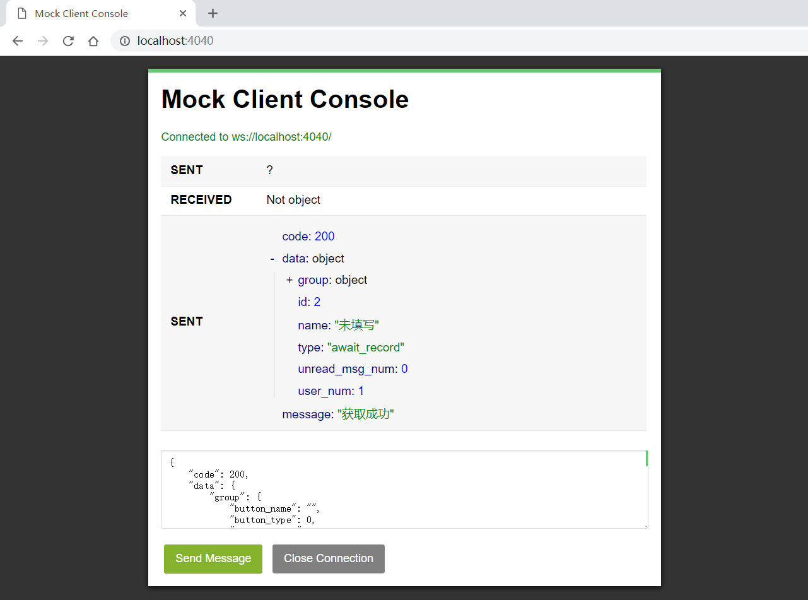

A simple and configurable mock server with UI console for websocket, with which you can either send message manually or make rules to get matched response. Err... It's hard to summarize, Let's take a look!

# Installation

## npm package

```
npm install websocket-mock-server
```

or

```
yarn add websocket-mock-server
```

## github repo

```
git clone https://github.com/EmiyaYang/websocket-mock-server.git
```

```
npm install
npm run build
npm run test
```

or

```
yarn install
yarn build
yarn test
```

# Configuration

package.json
```json
{
  "script": {
    "mock": "wsmock -c CONFIG_PATH"
  }
}
```

Terminal
```
npm run mock
```

or 
```
yarn mock
```

The following config.js will be used and watched as default config when no `CONFIG_PATH` is provided.
```javascript
module.exports = {
  port: 4040,
  // a function exported to handle specific input and return output which will be sending later.
  rule: function (input) {}
  // set the delay time before sending auto message 
  autoMsgTimeout: 1000,
};
```

# UI Console

UI Console provide a chatroom-like way for you to send WebSocket message to server, which will be broadcast to other clients.



# TODO

- [ ] feat: Serial message flow test